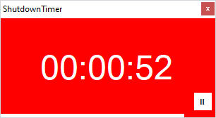

# ShutdownTimer

A simple shutdown timer using .NET Framework 2.0 and no additional dependencies. Works on pretty much any Windows version.

## Usage

```Bash
ShutdownTimer.exe --timer 120
```

## Options

```Bash
  ShutdownTimer --timer 120            Set shutdown timer in seconds or hh:mm:ss from now
  ShutdownTimer --at 17:00:00          Set shutdown at time hh:mm:ss
  ShutdownTimer --noprogress           Hide progress bar
  ShutdownTimer --nopause              Hide pause button
  ShutdownTimer --reboot               Reboot rather than shutdown ⁽¹⁾
  ShutdownTimer --shutdown             Shutdown rather than reboot ⁽¹⁾
  ShutdownTimer --width                Width of the main window (in pixels)
  ShutdownTimer --height               Height of the main window (in pixels)
  ShutdownTimer --background Teal      Background color of the main window, i.e. "Red" or "#ff0000"
  ShutdownTimer --font "Consolas"      Timer font
  ShutdownTimer --fontsize 40          Timer fontsize
  ShutdownTimer --saveconfig           Save settings to ShutdownTimer.default in current directory
```

<sup>(1)</sup> *The default action is to shutdown unless the program is executed on Windows Server, in this case the default action is reboot. The default action can be overridden by --reboot or --shutdown respectivly.*